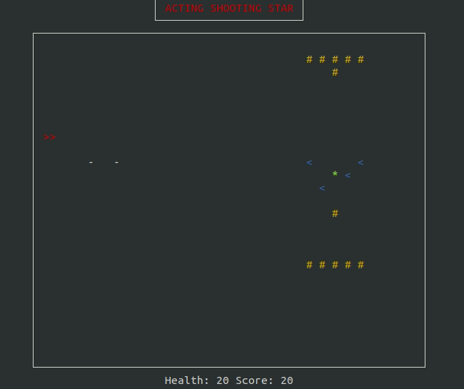

# Introduction

​	This project represents an implementation in `Racket` language of an actor model named Acting shooting star.

# Authors

Here is a list of the contributers to this project:

- Mohamed Faycal Boullit
- Mamadou Moussa Guimba
- Hugo Pierre
- Jalal Izekki

This project has been accomplished under the supervision of  J. Calandra.

# Usage

​	In order to use this project, it is necessary to have installed `raart` and `lux` packages. The project can be run using the following commands:

```bash
make project # to run the game
make test # to run the test files
make doc # to generate documentation files
make clean #to remove all the generated files and establish the initial state of the project repository
```

It is also possible to run the game with a different value of FPS (frames per second) by using the command

```
racket src/main.rkt -f FPS
```

Where FPS is replaced with a value in $[[1~;~60]]$.

# Documentation

​	The documentation for this project is written in scribble language. See [Usage](#Usage) section for how to generate it. The version of the generated documentation is HTML. 

# Report

​	The report describing the results of this project in more details has been written in $\LaTeX$ . All the resources can be found in the repository named `report`.

Use the following command inside the report's repository:

```bash
make # to generate a pdf version of the report
make clean # to remove the generated files after the compilation
make cleanall # to establish the initial state of the report repository
```


 
